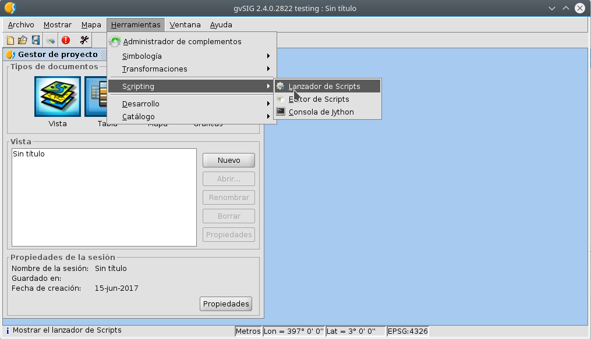
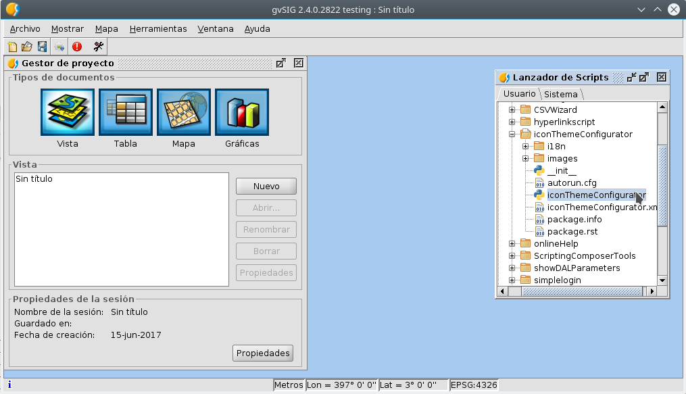
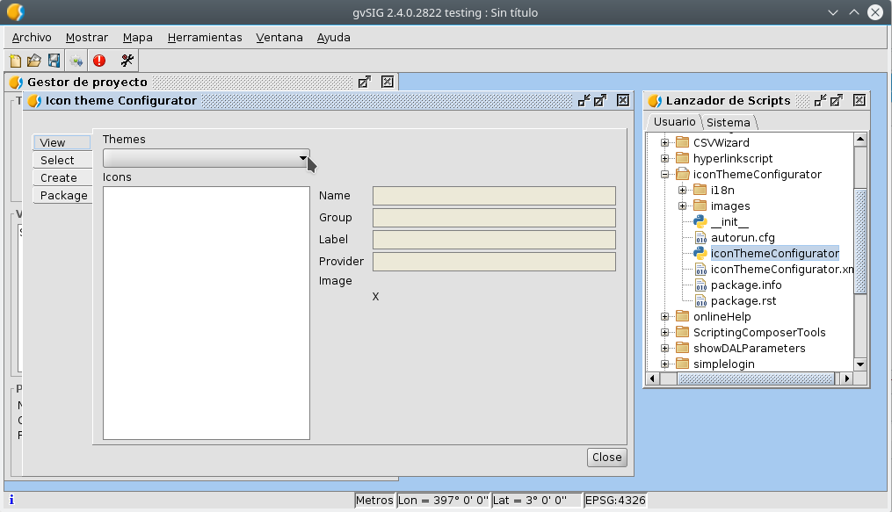
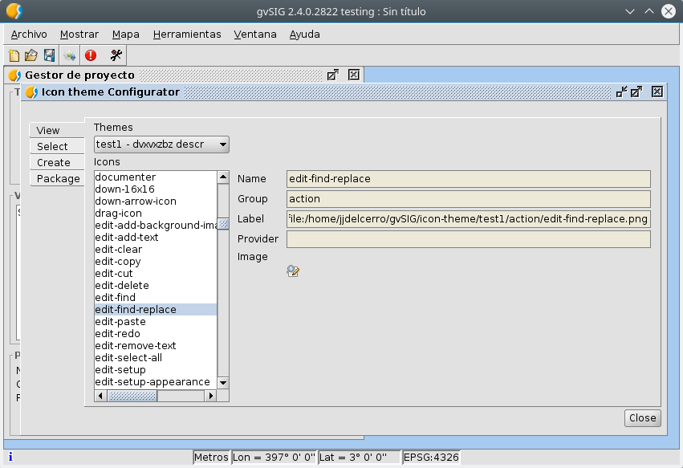
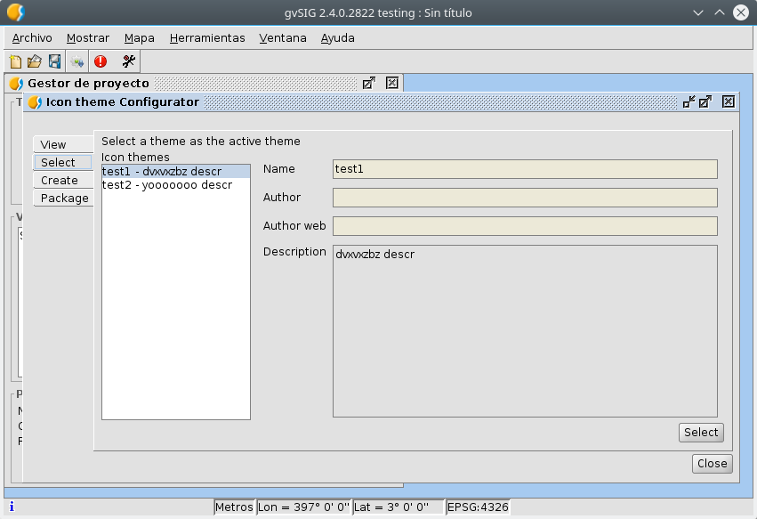
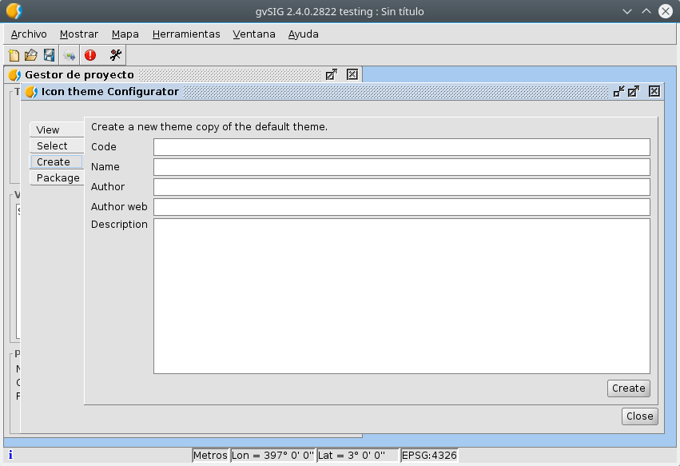
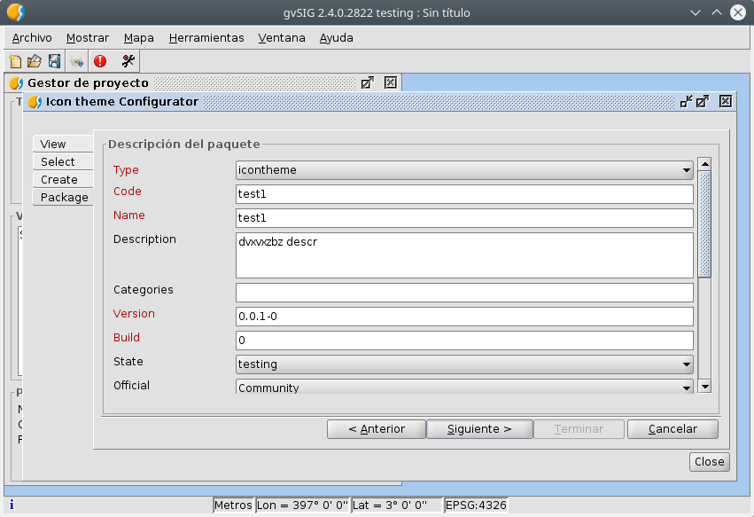

:orphan:

Descripción
==============

Esta utilidad permite crear *juegos de iconos* a partir del juego de 
iconos por defecto para poder modificarlos y crear nuestro propio
juego de iconos.

Ademas permite crear un *paquete* con el juego de iconos que hemos creado
para poder instalarlo desde el *administrador de complementos*.

Con la utilidad podremos:

- Ver los juegos de iconos que tenemos instalados.

- Seleccionar un juego de iconos como el juego de iconos corriente
  de gvSIG.

- Crear un nuevo juego de iconos.

- Crear paquetes con nuestros juegos de iconos.

Para gestionar juegos de iconos, gvSIG ya tiene en las preferencias la
posibilidad de seleccionar el juego de iconos a usar de entre los instalados,
pero no ofrece ninguna del resto de estas funcionalidades.

Vamos a ir viendo un poco esto; pero antes veremos como lanzar la herramienta
para el manejo de juegos de iconos, **"Icon theme configurator"** y en que consiste
un juego de iconos.

Que es un juego de iconos
============================

gvSIG lleva interno un juego de iconos con el que trabaja. Esto es todos los plugins de gvSIG, cuando tienen que usar
algun icono, lo registran en el juego de iconos por defecto, y luego en lugar de usar el icono directamente, se lo
piden al juego de iconos.

Ademas del juego de iconos por defecto, gvSIG permite cargar otros juegos de iconos. Normalmente estos los encontrariamos
en la carpeta "gvSIG/icon-theme" de nuestra carpeta de usuario. En esta carpeta encontraremos una carpeta por juego
de iconos que tengamos instalado. Los iconos cada desarrollador los agrupa en subcarpetas, pero el nombre del icono debe
ser unico dentro del juego de iconos, sin importar al grupo al que pertenezca. Encontraremos grupos como:

- **action**, las acciones asociadas a los menus y barras de herramientas.
- **cursor**, los distintos cursores que hay en gvSIG.
- **document**, los iconos correspondientes a los tipos de documentos en la ventana de proyecto.
- **layer**, con los iconos que tendran las capas en el TOC.
- o **legend**, con los iconos que se presentan en al cuadro de simbologia de una capa.

Junto con los ficheros de imagenes, habra tambien un fichero "package.info" con los metadatos del paquete. 
Es importa que este fichero contenga los datos correctos para que sea posible generar correctamente los paquetes de instalacion.

Nosotros podremos crear nuestro propio juego de iconos, copiando los iconos el tema por defecto y dandole un nombre, 
y editando los metadatos del juego de icono en el fichero "package.info".

Iniciar el Icon theme configurator.
======================================

Esta herramienta puede o no ir instalada por defecto en gvSIG.
En caso de que no vaya instalada por defecto en gvSIG debera instalarse a traves
del administrador de complementos. Deberia aparecer simplemente poniendo **"icon"** en 
el *filtro rapido*, en el panel de *seleccion de paquetes* del administrador de complementos.

Ya instalada, la herramienta no dispone de boton en la barra de herramientas de gvSIG o
de entrada en los menus. Para lanzarla hay que hacerlo a traves del 
**"lanzador de scripts"**, o directamente desde el editor de scripts.

Abriremos el *"lanzador de scripts"*:

Y en el seleccionaremos el script *"iconThemeConfigurator"*, haciendo doble
click sobre el:

Y se nos abrira la ventana de la herramienta de configuracion de juegos 
de iconos.

Ver los juegos de iconos que tenemos instalados.
===================================================

Una vez abierto el *"Icon theme configurator"*, veremos que a la derecha hay varias pestañas.
En la pestaña "View", podremos ver la lista de juegos de iconos que tenemos instalados, y seleccionando
los iconos podremos previsualizarlos, asi como su nombre y grupo al que pertenecen.

Seleccionar un juego de iconos.
====================================

Accederemos a esta funcionalidad en la pestaña "Select" del *"Icon theme configurator"*.
Veremos la lista de juegos de iconos instalados y nos permitirar selecionar uno como
el juego de iconos por corriente en gvSIG.

Esta funcionalidad tambien esta disponible en el panel de preferencias de gvSIG.

Crear un nuevo juego de iconos.
===================================

Accederemos a esta funcionalidad en la pestaña "Create" del *"Icon theme configurator"*.
Esta utilidad lo que hara sera exportar a un carpeta dentro de "gvSIG/icon-theme" de la
carpeta del usuario el juego de iconos interno de gvSIG.

Nos pedira que le demos algunos datos como *codigo*, *nombre*, *autor* o *descripcion*. 
Los mas importantes son el de *codigo* y *nombre*, siendo el *codigo* el nombre con el que
creara la carpeta para el juego de iconos es "gvSIG/icon-theme". Es recomendable que no
contenga espacios ni caracteres especiales, solo letras, numeros y guiones.

Una vez ya tengamos la carpeta con nuestro juego de iconos, podremos ir a ella y reemplazar las
imagenes que nos ineteresa por las nuestras. Es muy importante mantener el mismo nombre de las
imagenes.

Una vez personalizado podremos seleccionarlo como juego de iconos corriente para usarlo en
gvSIG.

Crear paquetes con nuestros juegos de iconos.
==============================================

Accederemos a esta funcionalidad en la pestaña "Create" del *"Icon theme configurator"*.
Con esta utilidad podremos crear paquetes para nuestros juegos de iconos.

Nos pedira que seleccionemos la carpeta de nuestro juego de iconos.
Le daremos a siguiente y rellenaremos los metadatos del paquete. 
Es importen rellenar los campos que aparecen en rojo.
Esta informacion sera la que se muestre en el administrador de complementos cuando
un usuario vaya a instalar el juego de iconos.
Le daremos otra vez siguiente y nos mostrara la ruta y nombre en la que se 
creara el paquete. Por defecto en la carpeta "install" de dentro de la instalacion
de gvSIG.

Para que un usuario instale el juego de iconos simplemente tendremos que pasarle
ese fichero, y podra instalarlo desde el adminitrador de complementos seleccionandolo el 
fichero, o bien si lo copia a la carpeta "install" de la instalacion de gvSIG, le
aparecera entre los paquetes de la instalacion estandar de gvSIG.

